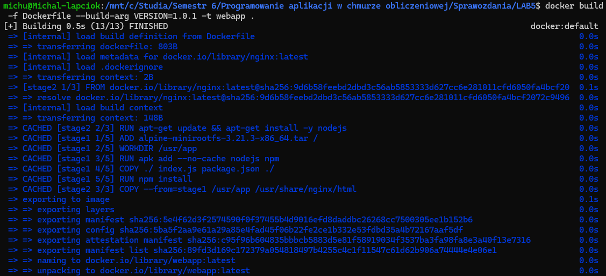
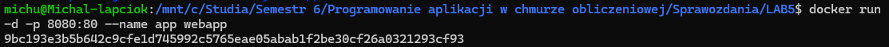
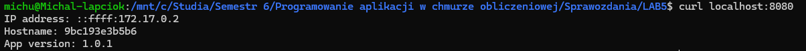
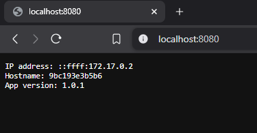

# Sprawozdanie z Laboratorium 5

# 1. Budowanie obrazu
`docker build -f Dockerfile --build-arg VERSION=1.0.1 -t webapp .`

# 2. Uruchomienie kontenera
`docker run -d -p 8080:80 --name app webapp`

# 3. Potwierdzenie działania kontenera
`docker ps`

# 4. Potwierdzenie działania serwera
`curl localhost:8080`

