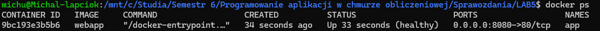

# Sprawozdanie z Laboratorium 5

# 1. Budowanie obrazu
```shell
docker build -f Dockerfile --build-arg VERSION=1.0.1 -t webapp .
```


# 2. Uruchomienie kontenera
```shell
docker run -d -p 8080:80 --name app webapp
```


# 3. Potwierdzenie działania kontenera
```shell
docker ps
```


# 4. Potwierdzenie działania serwera
```shell
curl localhost:8080
```


